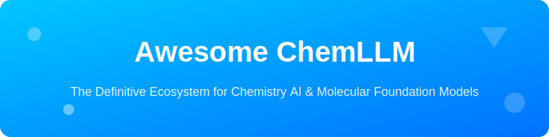

# Awesome-ChemLLM 🧪🧬

  

  <strong>The Definitive Ecosystem for Chemistry AI, Molecular Foundation Models, and Scientific LLMs</strong>

  
  
  
  
  

---

## 🌟 Overview

Welcome to **Awesome-ChemLLM**! This repository is a curated collection of the most advanced **SaaS Platforms**, **Open-Source Models**, and **Computational Tools** specifically designed for the Chemistry and Drug Discovery domain.

Whether you are a **Computational Chemist** 🧑‍🔬, a **Drug Discovery Researcher** 💊, or an **AI Engineer** 🤖, this list helps you find state-of-the-art tools for:
- 🧪 **Molecular Property Prediction** (ADMET, Toxicity, Solubility)
- ⚗️ **Reaction Prediction & Retrosynthesis**
- 🧬 **De Novo Molecule Design** & Lead Optimization
- 📚 **Scientific Literature Analysis** using specialized LLMs
- 💎 **Materials Science** & Energy Material Discovery

---

## 🗺️ Table of Contents
- [🚀 SaaS / Hosted Platforms](#-saas--hosted-platforms)
- [📂 Open-Source GitHub Projects](#-open-source-github-projects)
- [🤝 How to Contribute](#-how-to-contribute)
- [⚠️ Disclaimer](#-disclaimer)

---

## 🚀 SaaS / Hosted Platforms

### Core Chemistry AI Models 🏢

| Product | Company Size (Revenue/Valuation) | Pricing | Free Tier / Trial Limits | Description |
| :--- | :--- | :--- | :--- | :--- |
| **[ChemAxon](https://chemaxon.com/)** | ~$38.6M Revenue | Pay-per-use (Units) | Free for academic research | Leading cheminformatics platform with AI-powered tools for molecular design and analysis. |
| **[Energent.ai](https://energent.ai/)** | ~$37.5M Rev / ~$120M Val | Tiered (Free/Starter/Pro) | Permanent Free Tier | AI platform focused on energy materials and chemical discovery using specialized models. |
| **[ChemCopilot](https://chemcopilot.ai/)** | ~$941K Rev / ~$3.1M Val | Starts at $100/mo | 14-day free trial | AI assistant for chemists with integrated foundational models for synthesis planning. |
| **[SynAsk](https://synask.ai/)** | Seed Stage | Free (Academic Access) | Research platform access | Chemistry AI agent for synthesis route prediction and laboratory assistance. |

### Advanced & Specialized Platforms 🏗️

**Other notable mentions**: Various academic chemistry LLMs and commercial drug discovery platforms.

---

## 📂 Open-Source GitHub Projects

### Dedicated Chemistry AI Foundational Models & Toolkits 🛠️

- **[DeepChem](https://github.com/deepchem/deepchem)**   
  Popular open-source library for deep learning in drug discovery, materials science, and quantum chemistry. 🧪

- **[RDKit](https://github.com/rdkit/rdkit)**   
  The gold-standard open-source cheminformatics toolkit. Powers most chemistry AI projects. ⚗️

- **[TorchDrug](https://github.com/DeepGraphLearning/torchdrug)**   
  PyTorch-based library for drug discovery with powerful graph neural networks. 🧬

- **[OpenChem](https://github.com/Mariewelt/OpenChem)**   
  Open-source deep learning toolkit specifically for chemistry and drug discovery. 🔍

- **[ChemBERTa](https://github.com/seyonechithrananda/chemberta)**   
  Open-source chemistry-adapted BERT model for molecular property prediction. 🤖

- **[MolFormer](https://github.com/IBM/MolFormer)**   
  Open-source transformer model for molecular representation learning. 📐

- **[LlaSMol](https://github.com/hkust-nlp/LlaSMol)**   
  Large language model tailored for small molecules with excellent SMILES handling. 🗣️

- **[ChemDFM-R](https://github.com/OpenDFM/ChemDFM)**   
  Advanced chemistry domain-specific foundational model for chemical tasks. 📖

- **[ChemLLM](https://github.com/microsoft/ChemLLM)**   
  Chemistry-specialized large language model for molecular understanding. 🧠

- **[BatGPT-Chem](https://github.com/Wuhan-University-NLP-Group/BatGPT)**   
  Chemistry-focused variant of BatGPT optimized for molecular generation. 🦇

- **[ChemLLM Open Implementations](https://github.com/search?q=ChemLLM+open+source)**  
  Community reproductions and fine-tunes of chemistry LLMs. 👥

- **[ChemGPT](https://github.com/search?q=ChemGPT)**  
  Multiple open-source chemistry GPT-style models trained on chemical literature. 📚

### Additional Strong Open-Source Options 💠

- **[Graphormer](https://github.com/microsoft/Graphormer)**  — Microsoft’s graph transformer. 🕸️
- **[PySCF](https://github.com/pyscf/pyscf)**  — Quantum chemistry calculations in Python. ⚛️
- **[Uni-Mol](https://github.com/dptech-corp/Uni-Mol)**  — Unified molecular representation. 🔗
- **[AutoDock Vina](https://github.com/ccsb-scripps/AutoDock-Vina)**  — Popular molecular docking tool. 🔑

---

## 🤝 How to Contribute

1. **Fork** the repo 🍴
2. **Add/edit** entries in `README.md` (follow existing format) ✍️
3. **Submit PR** with a short explanation 🚀

Star the repo if you find it useful! ⭐

---

## 📈 Star History

  

---

## ⚠️ Disclaimer

- This is a **community-curated** list — not exhaustive and not an endorsement.
- AI-generated chemical predictions should always be validated experimentally. 🧪
- Many models require significant computational resources. 💻

---

  <b>Made with ❤️ for the Chemistry & AI Community</b> 
  Let's make chemistry AI more accessible, open, and powerful!

---

**Keywords:** Chemistry AI, ChemLLM, Molecular LLM, Drug Discovery AI, Cheminformatics, SMILES, Retrosynthesis AI, Molecular Foundation Models, Deep Learning Chemistry.
